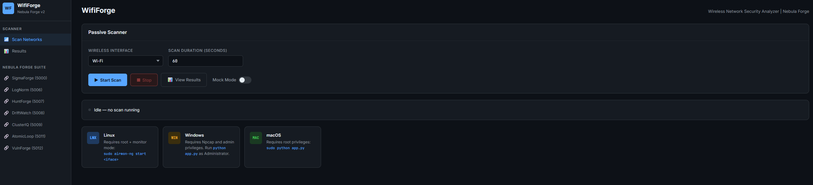
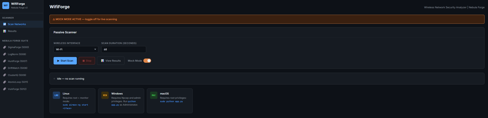
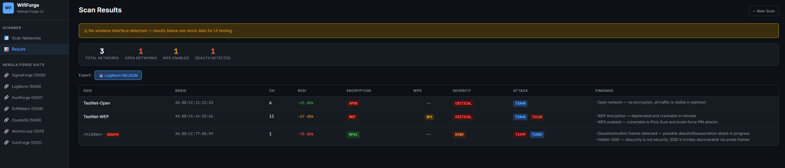

<div align="center">

# WifiForge
 
**Wireless Network Security Analyzer | Nebula Forge Detection Suite v2**
 
[](https://python.org)
[](https://flask.palletsprojects.com)
[](LICENSE)
[](https://github.com/Rootless-Ghost/Nebula-Forge)
 
WifiForge passively scans wireless networks, assesses security posture, detects deauth attacks and rogue configurations, maps findings to MITRE ATT&CK techniques, and exports results to the Nebula Forge LogNorm pipeline.
 
---
 
## Overview

</div>
 
WifiForge upgrades passive WiFi scanning from raw packet capture to structured security intelligence. Every detected network is assessed for vulnerabilities — open encryption, WEP, WPS exposure, deauth activity, hidden SSIDs — and mapped to ATT&CK techniques for downstream detection workflows.
 
---
 
## Features
 
- **Passive scanning** — 802.11 beacon frame capture via Scapy, no active probing
- **Encryption detection** — WEP, WPA, WPA2, WPA3, Open — parsed from beacon RSN/vendor IEs
- **Deauth detection** — flags networks receiving deauth frames (active attack indicator)
- **WPS detection** — identifies WPS-enabled networks vulnerable to brute force
- **Hidden SSID detection** — flags networks broadcasting empty SSIDs
- **MITRE ATT&CK mapping** — per-finding technique tags (T1040, T1110, T1499, T1583)
- **Severity scoring** — CRITICAL / HIGH / MEDIUM / LOW per network
- **LogNorm export** — ECS-lite NDJSON for the Nebula Forge normalization pipeline
- **Mock mode** — runs without hardware for UI testing and demos
- **Dark UI** — Nebula Forge dark theme, consistent with the full suite

---

## Screenshots




  


  

---

## Requirements

- Python 3
- Root privileges (needed for monitor mode)
- Wireless interface that supports monitor mode

## Part of Nebula Forge
 
WifiForge is part of [Nebula Forge](https://github.com/Rootless-Ghost/Nebula-Forge) — an open-source SOC platform covering the full detection engineering workflow.
 
| Tool | Port | Role |
|------|------|------|
| LogNorm | 5006 | Log normalization (ECS-lite) |
| HuntForge | 5007 | ATT&CK hunt playbook generation |
| DriftWatch | 5008 | Sigma rule drift analysis |
| ClusterIQ | 5009 | Alert clustering and triage |
| AtomicLoop | 5011 | Atomic Red Team test runner |
| VulnForge | 5012 | Vulnerability & exploit intelligence |
| **WifiForge** | **5013** | **Wireless network security analysis** |
 
---
 
## Installation
 
```bash
git clone https://github.com/Rootless-Ghost/WifiForge.git
cd WifiForge
pip install -r requirements.txt
```
 
**Platform requirements:**
- **Linux**: Run as root or with `CAP_NET_RAW`. Put interface in monitor mode first: `sudo airmon-ng start wlan0`
- **Windows**: Install [Npcap](https://npcap.com) before running
- **macOS**: Run as root
```bash
sudo python app.py   # Linux/macOS
python app.py        # Windows (as Administrator)
```
 
Access at `http://localhost:5013`
 
---

## Usage
 
### Web UI
 
1. Select wireless interface from dropdown
2. Set scan duration (default 60 seconds)
3. Click **Start Scan**
4. Monitor live network discovery in real time
5. Click **View Results** when scan completes
6. Export findings to LogNorm NDJSON
### Mock Mode
 
No wireless hardware required for testing. If no interface is available, WifiForge loads a mock dataset of 3 networks demonstrating CRITICAL, HIGH, and MEDIUM severity findings.
 
---
 
## ATT&CK Mapping
 
| Finding | Technique | Tactic |
|---------|-----------|--------|
| Open/WEP network | T1040 — Network Sniffing | Discovery |
| WPS enabled | T1110 — Brute Force | Credential Access |
| Deauth frames detected | T1499 — Endpoint Denial of Service | Impact |
| Hidden SSID | T1583 — Acquire Infrastructure | Resource Development |
 
---

## Export Format
 
### LogNorm NDJSON (ECS-lite)
```json
{
  "event.kind": "alert",
  "event.category": "network",
  "network.ssid": "TargetNetwork",
  "network.bssid": "AA:BB:CC:DD:EE:FF",
  "network.channel": 6,
  "network.encryption": "WEP",
  "network.wps_enabled": true,
  "vulnerability.severity": "CRITICAL",
  "threat.technique.id": "T1040",
  "threat.technique.name": "Network Sniffing",
  "source.tool": "WifiForge",
  "@timestamp": "2026-04-15T00:00:00Z"
}
```
 
---
 
## Requirements
 
- Python 3.10+
- `flask`, `scapy`, `python-dotenv`
- Npcap (Windows) or root privileges (Linux/macOS)
- Wireless interface with monitor mode support (optional — mock mode available)
---
 
## Responsible Use
 
WifiForge is intended for authorized security testing of networks you own or have explicit written permission to test. Passive scanning may still be regulated in some jurisdictions. Unauthorized wireless scanning may violate laws and regulations.

## Features in Development

- [ ] WPA3 security assessment

## Responsible Use
 
WifiForge is intended for authorized security testing of networks you own or have explicit written permission to test. Passive scanning may still be regulated in some jurisdictions. Unauthorized wireless scanning may violate laws and regulations.

## License

This project is licensed under the MIT License — see the [LICENSE](LICENSE) file for details.


<div align="center">

Built by [Rootless-Ghost](https://github.com/Rootless-Ghost) 

</div>
